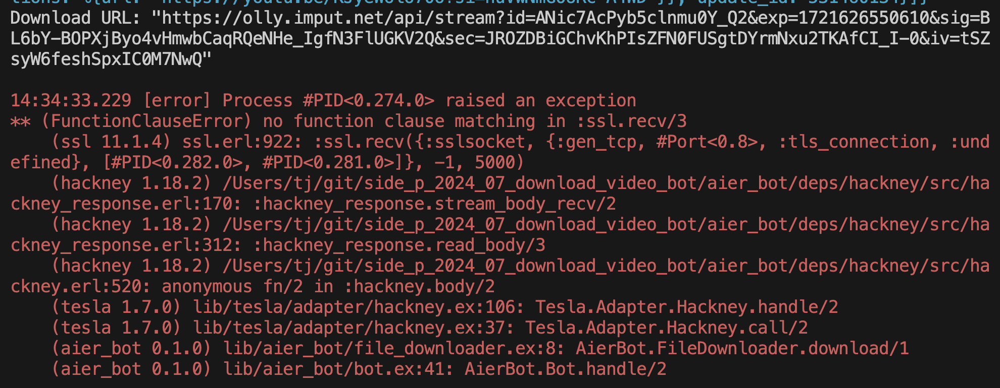
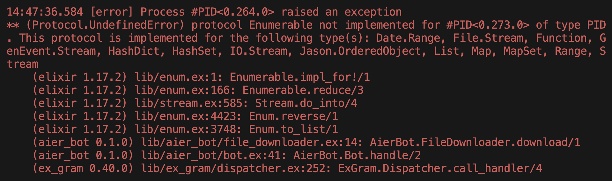
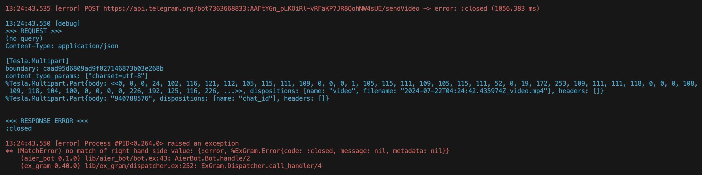
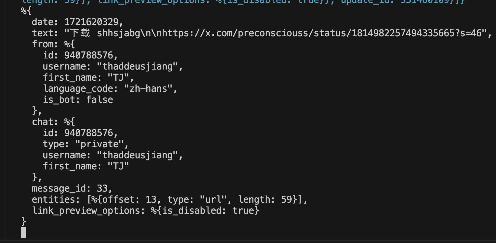

# 2024-08-09 only bot owner can login and update folder

```elixir
# 一般
%{
  date: 1_723_185_293,
  text: "",
  from: %{
    id: 940_788_576,
    username: "ThaddeusJiang",
    first_name: "TJ",
    language_code: "zh-hans",
    is_bot: false
  },
  chat: %{
    id: -4_255_771_899,
    type: "group",
    title: "Ren and My J",
    all_members_are_administrators: true
  },
  message_id: 734,
  entities: [%{offset: 0, type: "bot_command", length: 24}]
}

```

- 在一个包含 bot 的 group 随便发送 message

```elixir
# owner
%{
  date: 1723105666,
  text: "我只是试试",
  from: %{
    id: 1087968824,
    username: "GroupAnonymousBot",
    first_name: "Group",
    is_bot: true
  },
  chat: %{id: -1002229528208, type: "supergroup", title: "📝个人记事本"},
  message_id: 19,
  sender_chat: %{
    id: -1002229528208,
    type: "supergroup",
    title: "📝个人记事本"
  }
}
```

在一个包含 bot 的 group，发送 command

```elixir
%{
  date: 1_723_105_562,
  text: "",
  from: %{
    id: 1_087_968_824,
    username: "GroupAnonymousBot",
    first_name: "Group",
    is_bot: true
  },
  chat: %{id: -1_002_229_528_208, type: "supergroup", title: "📝个人记事本"},
  message_id: 16,
  entities: [%{offset: 0, type: "bot_command", length: 24}],
  sender_chat: %{
    id: -1_002_229_528_208,
    type: "supergroup",
    title: "📝个人记事本"
  }
}
```

TIL: base64url RFC 4648 可以生成 URL and filename safe alphabet.

https://x.com/kitayoshi_son/status/1815740828993962028

TIL: base64 可能包含 / + 等特殊字符，在作为文件路径时可能产生 bug。

- Base32 和 Base16 都不包含特殊字符
- Base16（十六进制编码）在可读性和广泛使用方面具有优势，尤其是在软件开发和调试中。和 css color 类似

- [x] bug: [error] File.write failed, reason: enametoolong

```elixir
hashed_url = :crypto.hash(:sha256, download_url) |> Base.url_encode64(padding: false)
```

- [x] bug: 21:38:27.786 [error] File.write failed, reason: enoent

- [x] 2024-07-23 file path 不能含有太多特殊字符，例如斜杠


# 2024-07-22 logger 自带前缀，不需要额外加了

```
21:42:39.299 [info] File written successfully
```

## FIXME: download youtube big video





## FIXME: bug: 无法发送 20 分钟的长视频



> Bots can currently send video files of up to 50 MB in size, this limit may be changed in the future.
> Check the documentation of this method in https://core.telegram.org/bots/api#sendvideo

## 2024-07-22 x.com 无法下载图片 tweet

like: https://x.com/magnum_d1ngus/status/1815029025984643510?s=46

## ex_gram message struct



# ins response

```elixir
%{"audio" => false, "picker" => [%{"thumb" => "https://olly.imput.net/api/stream?id=5F-rJeRJV2IIH7_DU1KCq&exp=1721617274907&sig=hVWhMvTYTZbSIJwbW_UOql8zdEIMgKH2R_96baKjy7o&sec=yVOd07mry2m3ONZodwScrl7oCry7jABNv8pUsApc-N0&iv=8LL5l-FFqdeOJWfH3M0aXA", "type" => "photo", "url" => "https://scontent.cdninstagram.com/v/t51.29350-15/452214393_889456523022480_3333917324961445363_n.heic?stp=dst-jpg_e35_s1080x1080&_nc_ht=scontent.cdninstagram.com&_nc_cat=1&_nc_ohc=nhiBpQU6K5AQ7kNvgFdgZrp&edm=APs17CUBAAAA&ccb=7-5&oh=00_AYCi1798737LrMfL0qSPCRI9o3KYmG4D7idgrDI9CswbhQ&oe=66A3A295&_nc_sid=10d13b"}, %{"thumb" => "https://olly.imput.net/api/stream?id=T-MMmhNqazoO81A14IREn&exp=1721617274907&sig=G__OYm9A07VjNNbZzQP1AfD1g91wa54qDZDeHOMcwmU&sec=lCn3sVp4p-k1saXjivoKKto0xaGJmac8wEvziacYr_w&iv=bT4ciTQRqkY_nEjlooAMwg", "type" => "photo", "url" => "https://scontent.cdninstagram.com/v/t51.29350-15/451967523_3981212428779897_6069480984263987958_n.heic?stp=dst-jpg_e35_s1080x1080&_nc_ht=scontent.cdninstagram.com&_nc_cat=1&_nc_ohc=ArPt3FrmzOUQ7kNvgHaO_EU&edm=APs17CUBAAAA&ccb=7-5&oh=00_AYDi93byaMp4kwKg4EzZDiwii21_NKILOLn0EBa4k4cbfQ&oe=66A38A12&_nc_sid=10d13b"}, %{"thumb" => "https://olly.imput.net/api/stream?id=NVNxeQMS7mZ4EE2yI4uvN&exp=1721617274907&sig=qcCyPPKzqa1haAlJCdlep0rLRwXQTvNb_dglA2zTvMM&sec=VbKAfrxhMMn_dXyMw8i5V50ULiA3hNtVFfFz1gHQ42c&iv=7Tv8zvUs041czaiBgYGY4Q", "type" => "photo", "url" => "https://scontent.cdninstagram.com/v/t51.29350-15/452375076_908971944396934_2465836769974186877_n.heic?stp=dst-jpg_e35_s1080x1080&_nc_ht=scontent.cdninstagram.com&_nc_cat=1&_nc_ohc=1HzprAm1iwsQ7kNvgFlGIPQ&gid=9a607a73793d416f9360f9443700bf51&edm=APs17CUBAAAA&ccb=7-5&oh=00_AYAaTBTpAIqYMGCKvdNQf9zEIMOS2dOqJZLz67fsxIHBRg&oe=66A39F8A&_nc_sid=10d13b"}, %{"thumb" => "https://olly.imput.net/api/stream?id=skfclVSbtokqhQWYyePZD&exp=1721617274908&sig=xxTik_Gr31NpYQQypAugz4nX7jUW0aCEYxwMuxJZ06M&sec=AEHSH-zR6ohQPpOqmOYa9O8kjdLSpyEjZuTlt3nXcZY&iv=uzH12VYZO3VLNcrHAi1Diw", "type" => "photo", "url" => "https://scontent.cdninstagram.com/v/t51.29350-15/452228905_367410816374471_7852385781784791159_n.heic?stp=dst-jpg_e35_s1080x1080&_nc_ht=scontent.cdninstagram.com&_nc_cat=1&_nc_ohc=aX5f4mGvnVIQ7kNvgGFEnA6&edm=APs17CUBAAAA&ccb=7-5&oh=00_AYDuHgX-K40lC4NfV-6FW_E54eZF-gg4UTar_7TGcpL4uQ&oe=66A3A24E&_nc_sid=10d13b"}, %{"thumb" => "https://olly.imput.net/api/stream?id=MTTY4-HC1v2pg2F_q2YAU&exp=1721617274908&sig=VU8EFG_f7dHqga3EnXnLcH_oPKEeVNXPrqdlo0mD8Nk&sec=U5CgHCJaLwI2MOjpmo03s7vfj5QFxiFNVeDWcEP6fQM&iv=-RuZYNNMyTVp2KpIowq4bw", "type" => "photo", "url" => "https://scontent.cdninstagram.com/v/t51.29350-15/452228911_3318139995154518_4883932498702162302_n.heic?stp=dst-jpg_e35_s1080x1080&_nc_ht=scontent.cdninstagram.com&_nc_cat=1&_nc_ohc=aGbLmpNayqoQ7kNvgFzXC8Q&edm=APs17CUBAAAA&ccb=7-5&oh=00_AYA9hQTZzCf2xipkRdXnU56SKD8wbNWhMwebMjh4lqfBVw&oe=66A385F1&_nc_sid=10d13b"}, %{"thumb" => "https://olly.imput.net/api/stream?id=OMYBVhNfM8BeCRz7fO9Yz&exp=1721617274908&sig=TJPIY1mwaekQmeP1hfHAcfevFvzCdSLgXfe575QVxQg&sec=qg1lGIWEeJrncp19EoZhjEpnc-OiurkXjJziGsZjs68&iv=n4esZveKpCisEmOznN95wQ", "type" => "photo", "url" => "https://scontent.cdninstagram.com/v/t51.29350-15/452210216_444024151553743_4298660291173762610_n.heic?stp=dst-jpg_e35_s1080x1080&_nc_ht=scontent.cdninstagram.com&_nc_cat=1&_nc_ohc=J7N6lN7o7cEQ7kNvgE6KZt7&edm=APs17CUBAAAA&ccb=7-5&oh=00_AYA77uIq17CjYN2SDctFRrRFKcM5-EkPZ09TN_PAUq8djQ&oe=66A3AD3B&_nc_sid=10d13b"}, %{"thumb" => "https://olly.imput.net/api/stream?id=uaa09EirBgeRc9smyU_dX&exp=1721617274908&sig=A6deXS9kht3yN3m4pongohJFtcUazmB12XNslZN0kVg&sec=lhbb1o0aTs_gGZ3pEIy7ydicu0AuGht0rQku5g1gCF8&iv=KbnrpgngQpqitb7FYzGvfg", "type" => "photo", "url" => "https://scontent.cdninstagram.com/v/t51.29350-15/451967516_1278010893604917_3972666716732793527_n.heic?stp=dst-jpg_e35_s1080x1080&_nc_ht=scontent.cdninstagram.com&_nc_cat=1&_nc_ohc=HWEf7HyB_9UQ7kNvgFzPYTi&edm=APs17CUBAAAA&ccb=7-5&oh=00_AYBhTYB1QdcL3H3MoVHAnD-9shUX4Y4jht342fniiIzmtw&oe=66A3B7C4&_nc_sid=10d13b"}, %{"thumb" => "https://olly.imput.net/api/stream?id=NijzBQbIGtSoa0asqOT7v&exp=1721617274908&sig=ebNOcPTJ3BPbg33maKAYESWezCE0j3x-2KC8VHPwvsg&sec=tRAkTt_12QkCcS4-RhHJ30V5OxF6t_blMjW9DZQ9KVU&iv=v8IaGCcNQy92xB8yDihEQQ", "type" => "photo", "url" => "https://scontent.cdninstagram.com/v/t51.29350-15/452227040_1206333037189915_458173170853920963_n.heic?stp=dst-jpg_e35_s1080x1080&_nc_ht=scontent.cdninstagram.com&_nc_cat=1&_nc_ohc=zcTyim1JTTgQ7kNvgFwVA4S&edm=APs17CUBAAAA&ccb=7-5&oh=00_AYClIaYa5EtT4XAk1PG0h-PC4JiqxWZLmXi1ulbl8JHU8A&oe=66A385C6&_nc_sid=10d13b"}, %{"thumb" => "https://olly.imput.net/api/stream?id=ap1VltMxKT-I1N8LL-T2d&exp=1721617274908&sig=FUo2bi8p7BizOIfZpS-oEvZFmDrSuYpKawC7vWz8xe0&sec=nuoAQpuiY51jbDkdsjLL0nKWq4NbaSGqSxXp5ER0ZUE&iv=6F4lINOeix3pYiJA401ueA", "type" => "photo", "url" => "https://scontent.cdninstagram.com/v/t51.29350-15/452227038_1402442430442706_1020569842860299930_n.heic?stp=dst-jpg_e35_s1080x1080&_nc_ht=scontent.cdninstagram.com&_nc_cat=1&_nc_ohc=OH3J4VrlbqsQ7kNvgGa1DpO&edm=APs17CUBAAAA&ccb=7-5&oh=00_AYCrTOODetIGET116j3wLDkhpTK0Zh3kEn_7Wo61xw-EIw&oe=66A3A5B5&_nc_sid=10d13b"}, %{"thumb" => "https://olly.imput.net/api/stream?id=zNBU426Ti02ICVC7lliAL&exp=1721617274909&sig=Vdyh6dUubrFhqoIlYK_HDaefABCPGSCdXMG7jVEJzlI&sec=zh_dx1yDm2AfeIkgW-4K5BOOp6EYxJPKilTyXC2pkfs&iv=eaRyms-lKpzhEtDa705aUw", "type" => "photo", "url" => "https://scontent.cdninstagram.com/v/t51.29350-15/451963306_811492997822997_1272700778613563056_n.heic?stp=dst-jpg_e35_s1080x1080&_nc_ht=scontent.cdninstagram.com&_nc_cat=1&_nc_ohc=CgES431AWXIQ7kNvgFQdWoN&edm=APs17CUBAAAA&ccb=7-5&oh=00_AYBCW3JSU2k1x68dnQQ4fuuq43NNZn1ujiY4sqnmoVEOIw&oe=66A39D0D&_nc_sid=10d13b"}], "pickerType" => "various", "status" => "picker"}
```

# telegram bot limit: only ont bot instance

```elixir
%{ok: false, description: "Conflict: terminated by other getUpdates request; make sure that only one bot instance is running", error_code: 409}
```

# 2023-09-15

issues: fly deploy --remote-only fails with:

```log
   ** (EXIT) an exception was raised:
          ** (UndefinedFunctionError) function Tesla.Adapter.Hackney.call/2 is undefined (module Tesla.Adapter.Hackney is not available)
```

resolved by

```sh
fly deploy --remote-only --no-cache
```

docs:

- [Continuous Deployment with Fly.io and GitHub Actions · Fly Docs](https://fly.io/docs/app-guides/continuous-deployment-with-github-actions/)
