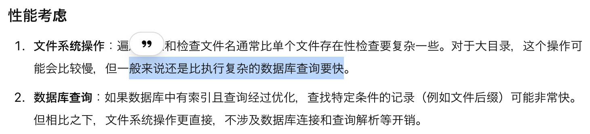

# ideas

- [ ] 为什么我不用 download url 作为文件名呢？

  优点：可以避免重复下载，提高用户体验以及 storage

  缺点：

  1. 无法直接观看视频和图片，因为文件后缀不对。

     1. 有一个解决方案：可以使用 filename.url 格式，url 即可。
     2. Q: elixir 读区 file 并判断文件名是否存在，是否比 database select 快？

     

- [ ] memo: filename 可以使用空格区分，#设计参考 macos history
